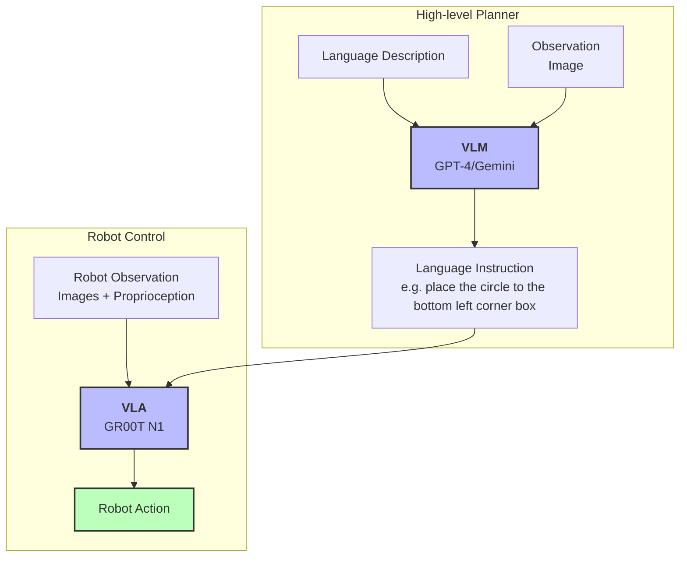

# Examples

## Modality.json

This provides additional examples of `modality.json` for different lerobot datasets. Copy the relevant `modality.json` to the dataset`<DATASET_PATH>/meta/modality.json`

- `so101_tricam__modality.json` matches the dual SO-101 arm + tri-camera setup highlighted in the [NVIDIA GR00T N1.5 SO-101 tutorial](https://huggingface.co/blog/nvidia/gr00t-n1-5-so101-tuning). It expects the state/action split (`left_arm`, `left_gripper`, `right_arm`, `right_gripper`) and remaps videos to `top`, `left_gripper`, and `right_gripper`. Use it when packaging datasets like `data/so101-table-cleanup`.

### Data config for fine-tuning

- Pass `--data_config so101_tricam_bimanual --dataset_path data/so101-table-cleanup` to `scripts/gr00t_finetune.py` (or `scripts/eval_policy.py`) once the dataset’s `meta/modality.json` matches the example above. This wires the dual-arm state/action layout and tri-camera video stack into the built-in transforms so the trainer can normalize joints and grippers separately.
- Run `python scripts/load_dataset.py --dataset_path data/so101-table-cleanup --embodiment_tag new_embodiment` to sanity-check the modality split before training.


## Eval GR00T N1 on SO100 and SO101

 - [eval_lerobot.py](./eval_lerobot.py): script to evaluate policy.
 - [eval_gr00t_so100.py](./eval_gr00t_so100.py) provides an example of how to use the finetuned model to run policy rollouts on a SO100 robot arm. (Before [Lerobot API redesign PR](https://github.com/huggingface/lerobot/pull/777))

> NOTE: This scripts meant to serve as a template, user will need to modify the script to run on a real robot.


## Tic-Tac-Toe Bot




This showcases the example of using a VLM as a high-level task planner (system 2) to plan the next action in a tic-tac-toe game, and GR00T N1 as the low-level action executor (system 1). This showcases language-conditioned on a GR00T N1 VLA. (e.g. "Place the circle to the bottom left corner box")

 * Example script: [tictac_bot.py](./tictac_bot.py)
 * [Example dataset](https://huggingface.co/datasets/youliangtan/tictac-bot)

```bash
# server
python scripts/inference_service.py --model_path <YOUR_CHECKPOINT_PATH> --server --data_config so100  --embodiment_tag new_embodiment

# client NOTE: this shouldn't run as it is, user will need to modify the script with relevant configs to make it work.
python tictac_bot.py
```
